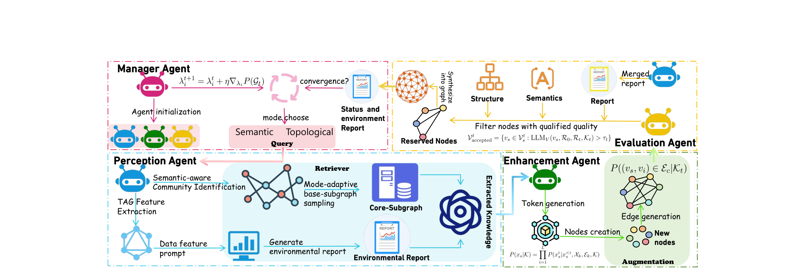
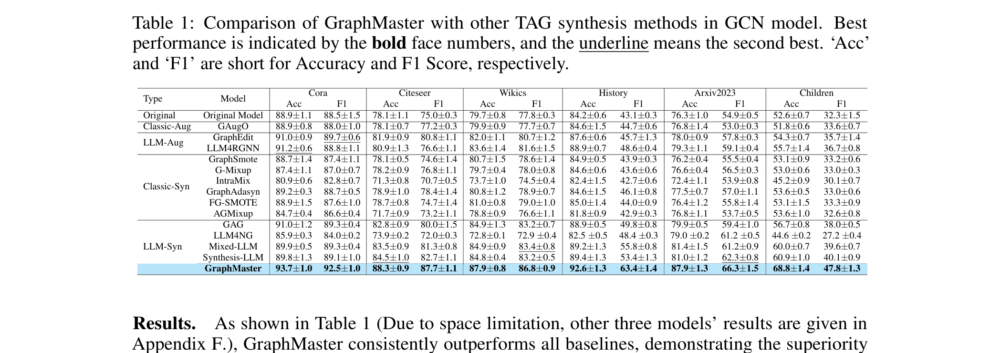
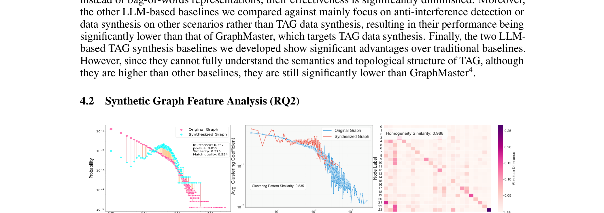
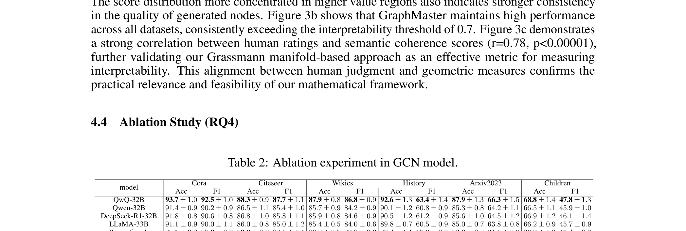

## Abstract

The era of foundation models has revolutionized AI research, yet **Graph Foundation Models (GFMs)** remain constrained by the scarcity of large-scale graph corpora. We introduce **GraphMaster** — the first multi-agent framework specifically designed for graph data synthesis in data-limited environments. GraphMaster orchestrates **four specialized LLM agents** (Manager, Perception, Enhancement, and Evaluation) that collaboratively optimize the synthesis process through iterative refinement, ensuring both semantic coherence and structural integrity.

---

## Motivation

Graph Foundation Models face a critical data bottleneck. Existing synthesis methods fail for three reasons: **(1)** classical augmentation (GraphSmote, G-Mixup) only manipulates structure, producing semantically empty nodes; **(2)** LLMs cannot process entire graphs within context windows; **(3)** uncoordinated LLM generation introduces hallucinations that violate graph topology.

---

## Method

GraphMaster decomposes graph synthesis into four specialized agents:

- **Manager Agent** — Selects between semantic and topological enhancement modes based on environmental analysis, and coordinates the entire synthesis workflow.
- **Perception Agent** — Overcomes context-window limitations via semantic-aware community detection, mode-adaptive seed selection, and hierarchical PPR-based diffusion sampling to extract representative subgraphs.
- **Enhancement Agent** — Generates new nodes and edges conditioned on extracted knowledge, with dual-mode generation for semantic coherence and structural fidelity.
- **Evaluation Agent** — Assesses quality through multi-dimensional scoring (semantic + structural), with adaptive threshold and temporal convergence detection for iterative refinement.

---

## Experimental Results

Evaluated on **6 data-limited benchmarks** with **4 GNN architectures** (GCN, JKNET, GraphSage, GAT) on 8x A100 GPUs using QwQ-32B as the base LLM.

GraphMaster consistently outperforms all baselines across all datasets. The bottom row (blue) shows GraphMaster achieving the highest accuracy and F1 scores on every benchmark.

### Graph Feature Preservation

The synthesized graphs maintain high fidelity: **KS statistic 0.357** (p=0.059) for degree distribution, **0.835** clustering coefficient similarity, and **0.988** label homogeneity — indicating near-perfect structural preservation.

### Ablation Study

Removing the Evaluation Agent causes the largest performance drop, confirming the critical role of iterative quality control. Each agent contributes uniquely to the final synthesis quality.
