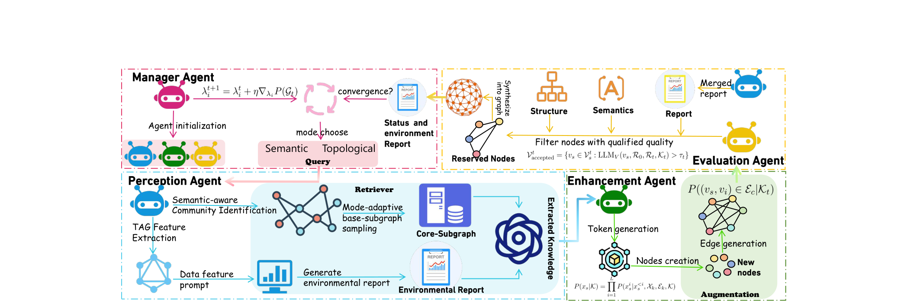
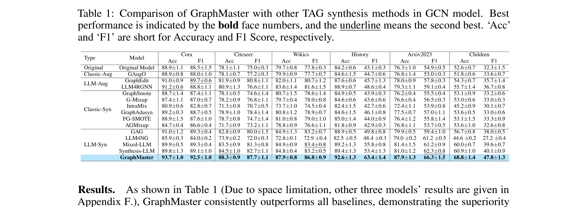
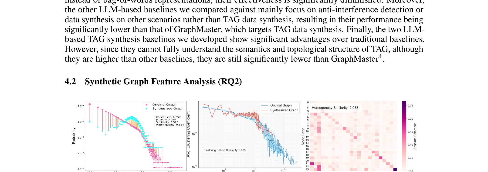
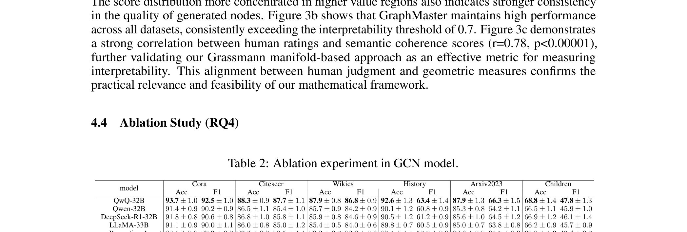

## Abstract

Graph Foundation Models need large, diverse graph corpora, but real-world graphs are often small, private, or expensive to annotate. **GraphMaster** turns graph synthesis into a coordinated agent workflow: four specialized LLM agents iteratively expand a text-attributed graph while preserving both its meaning and topology.

---

## Motivation

> The goal is not merely to make a graph larger. The new nodes must read naturally, connect plausibly, and remain useful for downstream learning.

Classical augmentation methods mainly manipulate topology and cannot generate meaningful textual attributes. Direct LLM generation introduces a different set of problems: whole graphs exceed context windows, locally plausible additions may violate global structure, and hallucinated nodes or edges can silently corrupt the training signal.

---

## Method

GraphMaster decomposes synthesis into four accountable roles:

- **Manager Agent** — Selects semantic or topological enhancement according to the current graph state and coordinates the workflow.
- **Perception Agent** — Overcomes context-window limitations via semantic-aware community detection, mode-adaptive seed selection, and hierarchical PPR-based diffusion sampling to extract representative subgraphs.
- **Enhancement Agent** — Generates new nodes and edges conditioned on extracted knowledge, with dual-mode generation for semantic coherence and structural fidelity.
- **Evaluation Agent** — Scores semantic and structural quality, then decides whether another refinement round is needed.

---

## Experimental Results

Evaluated on **6 data-limited benchmarks** with **4 GNN architectures** (GCN, JKNET, GraphSage, GAT) on 8x A100 GPUs using QwQ-32B as the base LLM.

GraphMaster consistently outperforms all baselines across all datasets. The bottom row (blue) shows GraphMaster achieving the highest accuracy and F1 scores on every benchmark.

### Graph Feature Preservation

The synthesized graphs maintain high fidelity: **KS statistic 0.357** (p=0.059) for degree distribution, **0.835** clustering coefficient similarity, and **0.988** label homogeneity — indicating near-perfect structural preservation.

### Ablation Study

Removing the Evaluation Agent causes the largest performance drop, confirming the critical role of iterative quality control. Each agent contributes uniquely to the final synthesis quality.
