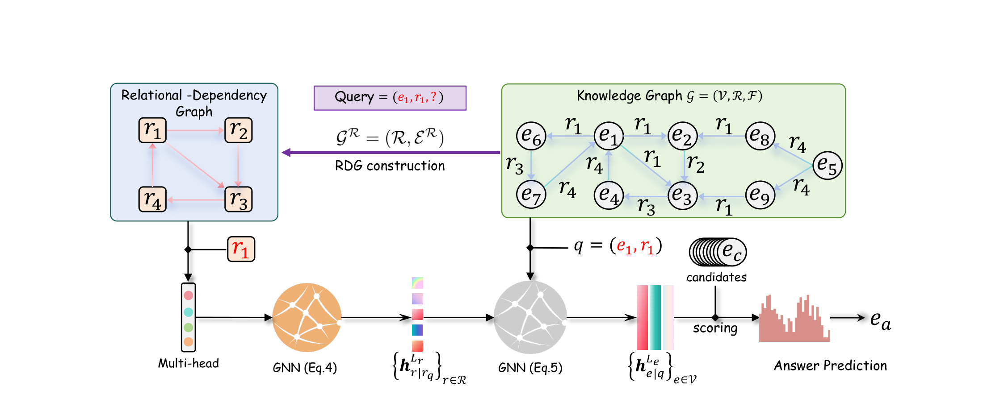
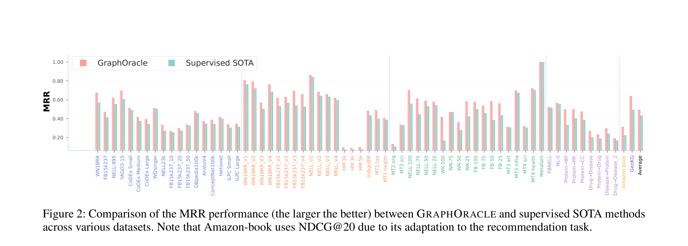
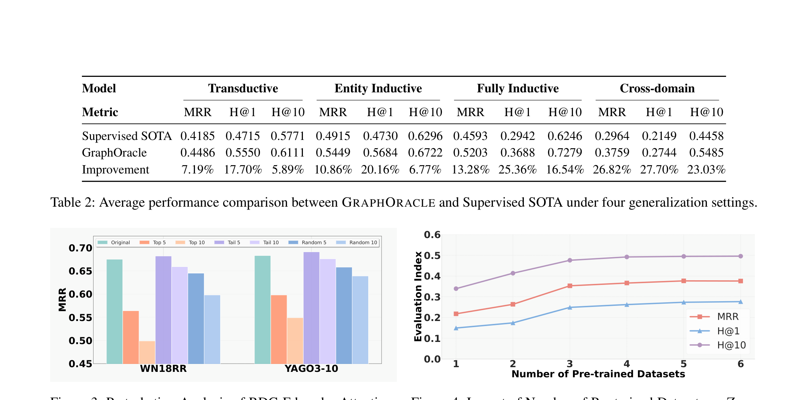
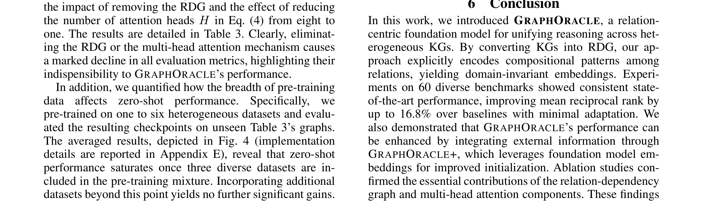

## Abstract

Knowledge graph reasoning in the **fully-inductive setting** — where both entities and relations at test time are unseen during training — remains an open challenge. We introduce **GraphOracle**, a novel framework that transforms each knowledge graph into a **Relation-Dependency Graph (RDG)** encoding directed precedence links between relations. A **multi-head attention** mechanism produces context-aware relation embeddings that guide inductive message passing over the original KG. Experiments on **60 benchmarks** show **up to 25% improvement** in fully-inductive and **28% in cross-domain** scenarios.

---

## Motivation

Existing fully-inductive methods (INGRAM, ULTRA) construct **undirected** relation graphs that are dense and fail to capture **directed compositional patterns** — e.g., "born_in → located_in" is a directional dependency that undirected graphs cannot distinguish. Furthermore, they are limited to single-domain scenarios and cannot transfer across entirely different knowledge graphs.

---

## Method

GraphOracle operates in three stages:

- **RDG Construction** — Transform the KG into a directed Relation-Dependency Graph where edge *(r_i, r_j)* indicates that relation *r_i* precedes *r_j* in observed triple chains. This is significantly sparser than prior relation graphs while capturing compositional patterns.
- **Query-Dependent Multi-Head Attention** — For each query relation, a multi-head attention GNN propagates messages over the RDG to produce context-aware relation embeddings. The same relation gets different representations depending on the query context.
- **Entity-Level Answer Prediction** — The learned relation embeddings parameterize a second GNN on the original KG entity graph, performing inductive message passing from the query entity to score candidates.

---

## Experimental Results

Evaluated across **60 benchmarks** spanning transductive, entity-inductive, fully-inductive, and cross-domain settings.

### MRR Comparison on 60 Datasets

GraphOracle (red) consistently matches or outperforms supervised SOTA (green) across all 60 datasets, with particularly strong gains on cross-domain and biomedical KGs.

### Average Performance (4 Settings)

GraphOracle achieves **+7.19%** MRR improvement in transductive, **+10.86%** in entity-inductive, **+13.28%** in fully-inductive, and **+26.82%** in cross-domain settings over supervised SOTA.

### Ablation Study

Removing the RDG structure or multi-head attention causes significant performance drops, confirming both components are essential. The directed precedence encoding is the single most important design choice.
