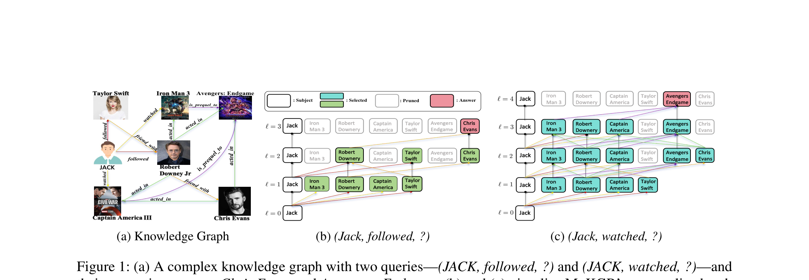
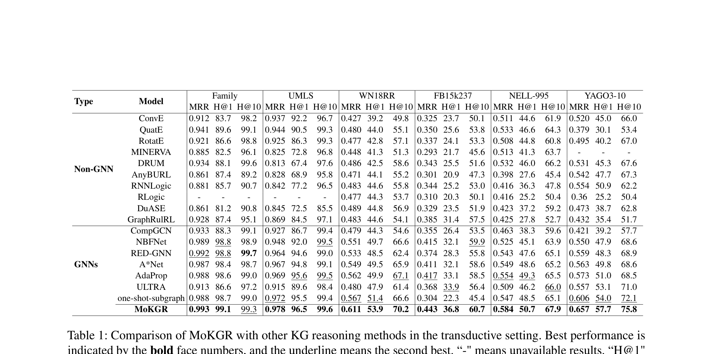
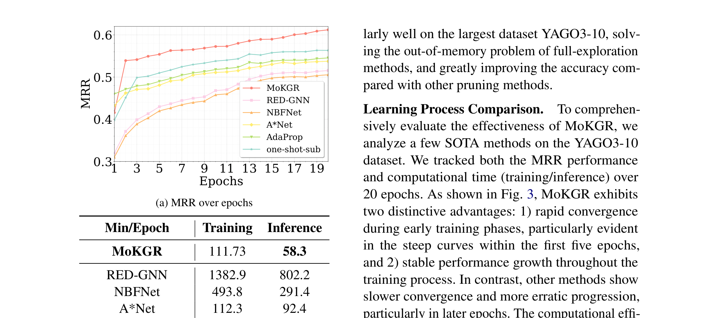
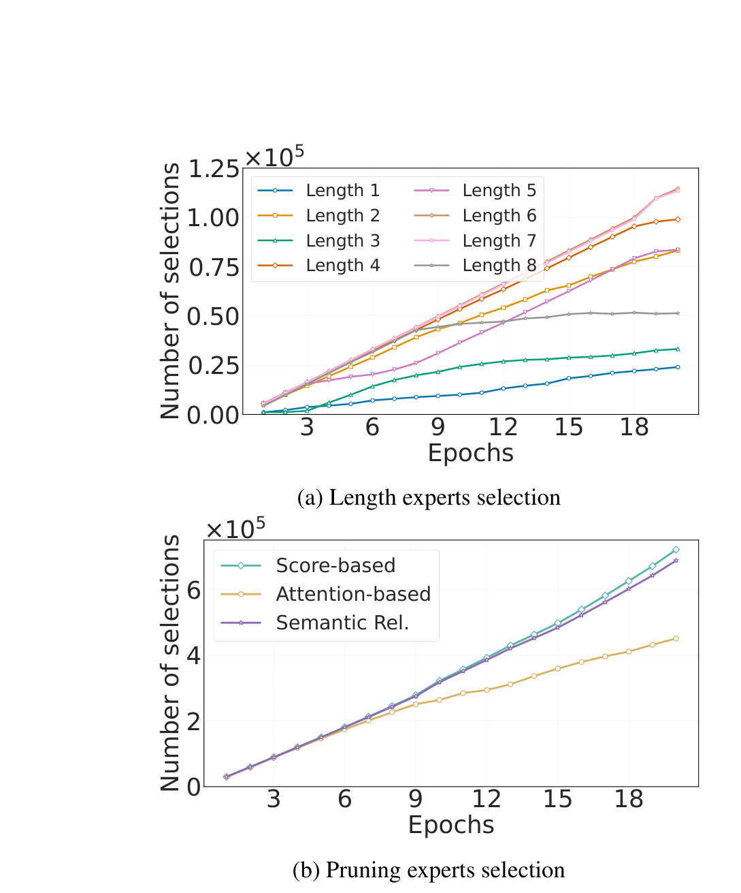
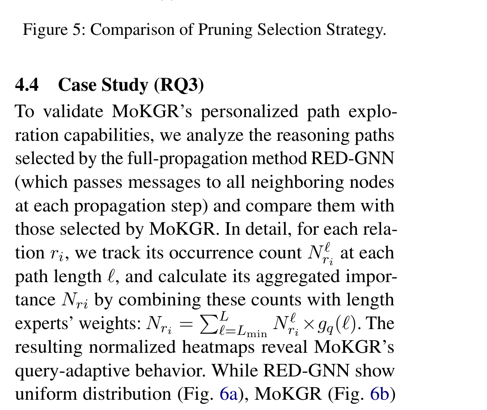

## Abstract

Knowledge Graph (KG) reasoning critically depends on constructing informative reasoning paths. Existing GNNs adopt rigid, query-agnostic strategies. We propose **MoKGR**, a mixture-of-experts framework with two innovations: **(1)** a **mixture of length experts** that adaptively weights path lengths based on query complexity, and **(2)** a **mixture of pruning experts** that evaluates paths from complementary perspectives. MoKGR achieves **state-of-the-art** in both transductive and inductive settings.

---

## Motivation

Consider two queries on the same graph: *(JACK, followed, ?)* can be resolved within 3 hops, while *(JACK, watched, ?)* requires deeper exploration. Existing methods use **fixed reasoning depth** for all queries and **uniform pruning criteria** — both are suboptimal. MoKGR personalizes both the depth and the pruning strategy per query.

---

## Method

MoKGR introduces two complementary Mixture-of-Experts modules:

- **Mixture of Length Experts** — Multiple experts specialized for different reasoning depths. A learned gating network computes query-specific weights over path lengths: simple queries route to short paths, complex queries activate deeper experts. The final output is a soft weighted combination.
- **Mixture of Pruning Experts** — At each GNN layer, multiple pruning experts evaluate candidate paths from complementary perspectives (structural, semantic, diversity). A learned aggregation selects the top-k most informative paths per query.
- **End-to-End Training** — Both modules are trained jointly with the answer prediction objective, ensuring optimal synergy between depth selection and path pruning.

---

## Experimental Results

### Transductive Setting (6 Benchmarks)

MoKGR achieves the best results across all 6 benchmarks (Family, UMLS, WN18RR, FB15k237, NELL-995, YAGO3-10), outperforming both non-GNN baselines and state-of-the-art GNN methods including NBFNet, RED-GNN, A*Net, and AdaProp.

### Efficiency & Convergence

MoKGR converges significantly faster than competing methods while maintaining lower inference time, demonstrating that personalized path exploration is both more accurate and more efficient.

### Expert Selection Analysis

The learned gating weights show interpretable patterns: the model prefers medium-length paths overall, but adapts dynamically — shorter paths for simple relational queries, deeper paths for complex multi-hop reasoning.

### Ablation Study

Removing the length experts causes the largest drop, confirming that adaptive depth is the most critical innovation. Removing pruning experts or using a single expert also degrades performance.
